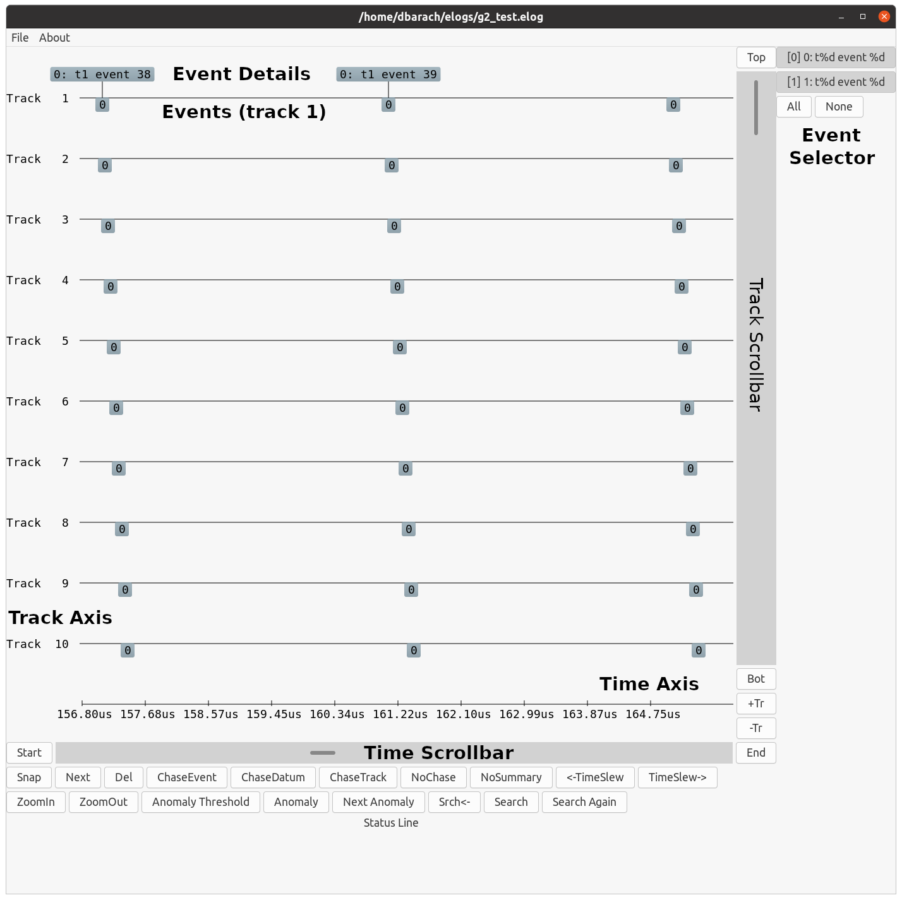

# vpp-event-viewer

This repo contains a vpp live data event viewer plugin x86_64 Debian
package. Also included: a standalone ubuntu-20.04 g2 Debian
package. The plugin should work with vpp master/latest images built on
or after 7/28/2021.

## Installation

Install vpp Debian packages corresponding to vpp itself, vppinfra, and
so on. The Debian package in this repo has the following dependencies:

```text
    Depends: vpp (>= 21.01), libatk1.0-0 (>= 1.12.4), libc6 (>= 2.3.2),
    libcairo-gobject2 (>= 1.10.0), libcairo2 (>= 1.10.0),
     libgdk-pixbuf2.0-0 (>= 2.22.0), libglib2.0-0 (>= 2.31.18), libgtk-3-0
      (>= 3.21.4), libharfbuzz0b (>= 0.6.0), libpango-1.0-0 (>= 1.14.0),
       libpangocairo-1.0-0 (>= 1.14.0)
```

## Invocation

The GTK community objects to the use of the gtk libraries in setuid()
programs, on security grounds. The live event data plugin deals with
the situation and works with distro gtk-3/gdk-3 libraries anyway, but
one might not want to enable it in a mission-critical production
environment.

One specific detail which will prevent the live event viewer plugin
from starting when vpp runs as a service: comment out the "gid vpp"
stanza in the unix configuration portion of /etc/vpp/startup.conf:

```text
    unix {
      ...
      # gid vpp
      ...
    }
```

In this scenario, one must run vppctl as root. When running with the
vpp service, the event log viewer forcibly sets DISPLAY to ":1". It's
likely that you'll have to use "xhost +local:localhost" or some such
to convince the x server to allow the connection.

To start the live viewer:

```text
    # vppctl
    vpp# event-logger viewer
       or
    vpp# eve v
   or
    $ sudo /usr/bin/vpp unix interactive ## or sudo gdb /usr/bin/vpp
    ... messages ...
    vpp# event-logger viewer
```

The vpp event viewer plugin should start, and pop up a window which looks
a lot like this:


If that works, great! The live event viewer plugin has been
installed. If not, see if the plugin loaded:

```text
    vpp# show plugin
    <snip>
    40. g2_plugin.so v0.1 G2 Live Viewer plugin
```

Most likely, the plugin will have refused to load for one reason or
another. The "show log" debug CLI should give some clue about what
might have happened. Worst-case, run "/usr/bin/vpp unix interactive" and
watch for undefined symbol complaints concerning the "g2" plugin.

Undefined symbols are the most common reason that a plugin will refuse
to load. If that happens, it's likely that the installed version of vpp
is too old. Update the workspace from master/latest and try again.

If the plugin loaded OK but the "event-logger viewer" command didn't
yield a viewer window, check /var/log/syslog:

```text
    vpp[61923]: Unable to init server: Could not connect: Connection refused
    vpp[61923]: Graphics initialization failed, check $DISPLAY...
```

## G2 Standalone Viewer

The standalone g2 viewer g2-standalone-ubuntu-20-04 is identical to
the plugin viewer, except that it does not support shared-memory
access to the vpp event log.

After installing the listed dependencies, run the viewer:

```text
   $ g2 [file <filename>]
```

## Using the GUI

Here is an annotated G2 viewer screenshot, corresponding to a test pattern.



The viewer has two main scrollbars: the horizontal axis scrollbar
shifts the main drawing area in time; the vertical axis changes the
set of visible process traces.  The zoomin / zoomout operators change
the time scale.

The event selector menu changes the set of displayed events.  Using
these tools -- and some patience -- you can understand a given event
log.


### Mouse Gestures

The viewer has three fairly sophisticated mouse gesture interfaces,
which are worth describing in detail. First, a left mouse click on an
event pops up a per-event detail box. See above ("Event Details" /
"Events (track 1)"), "0: t1 event 38".

A left mouse click on an event detail box closes it.

To zoom to a region of the display, press and hold the left mouse
button, then drag right or left until the zoom-fence pair appears:


When the zoom operation completes, the display is as follows:


To measure the time between two points on the display, press and hold
the right mouse button; drag right or left until the time ruler
measures the region of interest.

If the time axis scale is coarse, single pixels can have significant
width in time. It's always a good idea to pick a reference location in
event boxes (e.g. left edge or right edge) when using the time ruler.

### Event Selector

The Event Selector enables or disables display of specific events. For
convenience, the event selector can disable or enable all events by
pressing the indicated buttons.

### Snapshots / Saved Views

Three buttons in lower left-hand corner of the viewer window control
the snapshot ring. Snapshots are simply saved views: maneuver the
viewer into an "interesting" configuration, then press the "Snap"
button to add a snapshot to the ring.

Click "Next" to restore the next available snapshot. The "Del" button
deletes the current snapshot.

See the hotkey section below for access to a quick and easy method to
save and restore the snapshot ring.

It's typical to set up a number of snapshots when making a set of
screenshots to explain a performance issue.

### Adjusting placement of tracks on the track axis

To swap the placement of two tracks on the track axis, "control-left
mouse click" on the bottom track. Immediately clicking again inverts
the operation

To move a track to a specific location ("First Visible", "Last
Visible", "First", or "Last), use "shift-left mouse click" and select
the desired location from the radio button menu.

Moving a track to the "Last" position is often used to "bury" an
uninteresting track

### Summary Mode

Summary mode declutters the screen by rendering events as short
vertical line segments instead of numbered boxes. Event detail display
is unaffected. The viewer starts in summary mode, zoomed out
sufficiently for all events in the trace to be displayed.  Given a
large number of events, summary mode reduces initial screen-paint time
to a tolerable value.

Once you've zoomed in sufficiently, press the "NoSummary" button (or
type the keyboard shortcut 'e') to enable boxed numeric event display.


### Keyboard Shortcut Map

The viewer supports a number of keyboard shortcuts

| Key | Function |
| --- | -------- |
| d   |                Delete Snapshot  |
| e   | Toggle Summary Mode |
| g   | Dump view geometry parameters (debug) |
| i   | Zoom In |
| l   | Show Memory Leaks (debug) |
| n   | Next Snapshot |
| o   | Zoom Out |
| q   | Quit |
| s   | Make New Snapshot |
| t   | Memory Leak Trace on/off toggle (debug) |

### Mouse Gestures

| Gesture | Function |
| ------- | -------- |
| Left Mouse down...move...release | Zoom to selected region |
| Control Left Mouse click | Swap Tracks |
| Shift Left Mouse click | Move Track (radio button menu) |
| Right Mouse down...move | Time Ruler |
